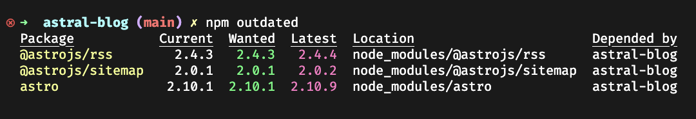
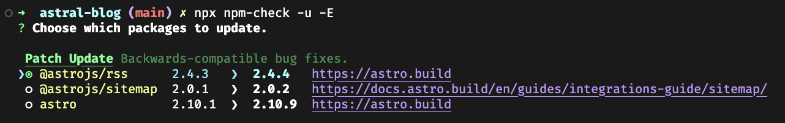

## Introduction

How many times do you work on a project and many dependencies are outdated, and neither you nor your colleagues want to take care of them because it's a huge tech debt task, especially with major versions?

This might not happen if you take care of your dependencies regularly; even better, it can be an opportunity to improve your codebase and learn new things that new versions bring.

## Basic solutions with npm

The simplest way to see if there are new versions of your dependencies is to run `npm outdated`, this command will show you the current version of your dependencies and the latest version available, pretty useful to get an overview.

From here we can do `npm update`, it will update all the dependencies to the latest version, but this is not always the best option because it can break your codebase, so you need to be careful, it's much better to update packages one by one and check if everything is working as expected by running your tests, especially with major versions.

Another task to do is to check how many vulnerabilities you have in your dependencies, easy to do by running `npm audit`, this will show you the vulnerabilities and the severity of outdated packages.

And while this tools are good _npm-check_ does a better job combining and improving them.

## A better way

There are some tools that can help you with this task, one of them is [npm-check](https://www.npmjs.com/package/npm-check).

The command `npx npm-check -u -E` will show an interactive list indicating the scope (_patch_, _minor_, _major_) of a newer version and a link to the changelog, so you can see what has changed and if it's worth updating it.

It makes incredibly easy to install each dependency once at a time to avoid breaking changes. My advice here is to always run the tests after installing any major version.

## Workflow

For maintenance tasks, I like to reserve some time on Fridays to do this kind of work, so I can end the week with a clean slate, and I can also use this time to learn new things.

I usually go through all the new dependencies and read the changelog, if I see something interesting, I update it, or make notes for future improvements based on the new features.

## Problems with alternatives

In my opinion, Dependabot feels more like spam than a useful tool; it create's a lot of PRs that are most often ignored, creating a lot of noise in your repository while not helping you understand what's going on with the new versions.

## Conclusion

Both your colleagues and future self will be thankful for your work on this task and the new knowledge you'll gain.

Take the time to appreciate and maintain the foundation that your projects are built upon.
