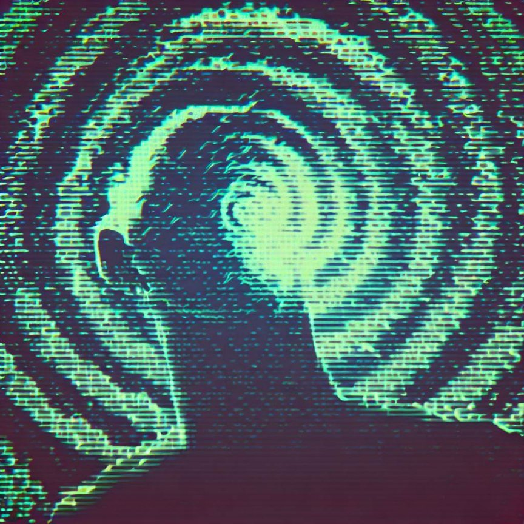

## Introduction

I never had to deal with drugs, or what's seen as a "serious" addiction. But I believe I've been addicted to other things, like video games, endless scrolling, and other more mundane entertainment.

There have been periods of time when I was aware of wasting my life in ways that made me feel bad about myself, and I don't mean feeling bad for not being a workaholic, but for really enjoying my time of reading or simply sitting in the grass looking at trees.

## The Loop

The loop is a cycle of repetition. It's a habit that you can't seem to break. It's a pattern that you can't seem to escape. It's a routine that you can't change.

The first step is to become aware of the loop. You have to be able to see it, and realize how it's negatively affecting your life.

At some point, I came to the realization that breaking the [loop](#the-loop) can only be done one way: **by replacing the addiction with something positive**.

Once you know what you have to get rid of, it's important to find a replacement. At this point, you have to understand that **there's no stop of of the bad habit by willpower alone**; the only way to get rid of it is by being busy enough with something else to the point that you don't have time to think about it.

## Breaking the loop

I used to spend time on places like [Reddit](https://www.reddit.com/) doing nothing but scrolling, rarely participating in the conversation.

At some point, I knew I was getting nothing from it, no fun, no growth, not even real entertainment, what I was watching was gone the moment the next piece of content came, creating nothing of value.

I took many approaches, some very effective, like blocking the content in tedious ways to use it, like blocking the domain in the hosts file, and while it reduced the consumption, it was still a problem, causing me to go back to the same pattern.

The only thing that worked was to completely replace it by reading. If I really want to go to *Reddit*, I always have better content prepared.

I store hundreds of articles in [Pocket](https://pocket.com/) to read later, I started to [read on my phone](http://localhost:3000/blog/reading-books-on-my-phone/). This way, I have content that really fulfills me, and I can do it anywhere, anytime, with the same convenience of scrolling *Reddit*.

That was the key factor: make it as convenient as possible and make it something that I really enjoy, and that's the only way to break the loop.

There are other habits that I've changed, like exercising. While I was always in shape, or at least thin, I always wanted to do more.

I was able to have enough determination to run often, but it never felt good for me, it made me lose more weight than I needed, and I didn't enjoy it. I was doing it because I thought it was the only way to exercise.

So it became another loop to break. I replaced it with [calisthenics](https://en.wikipedia.org/wiki/Calisthenics), I started to do it at home, and I really enjoy it.

I can do it anywhere, anytime, and for as long as I want. I can do it in a way that I enjoy and in a way that I can see progress, and that's the key factor: make it as convenient as possible and make it something enjoyable.

Find your loop and replace it.

