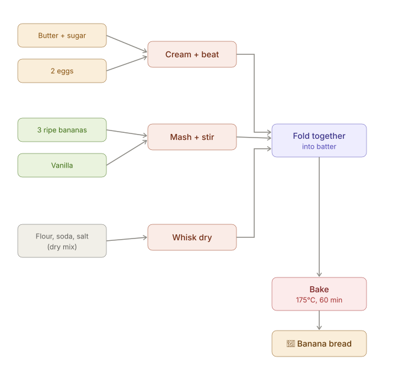
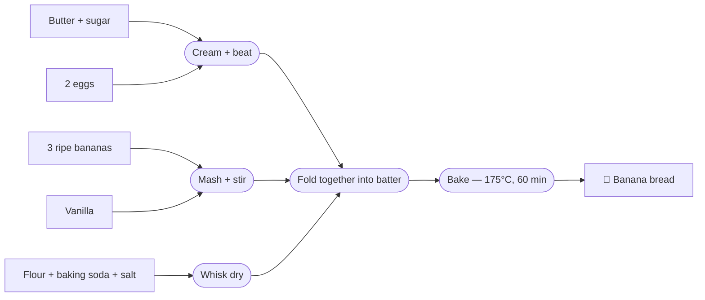

Inspired by Josh [Nesbitt's article](https://joshnesbitt.dev/thoughts/recipe-data-your-mind-can-make-sense-of), I decided to keep the [recipes](/recipes) that I have tried the same way as on [his site](https://joshnesbitt.cooking/). The [RecipeTables](https://recipetables.com/) format makes it so easy to understand the steps at a glance, and I love using generated charts similar to [mermaid.js](https://mermaid.js.org/), which I use often for work, so it's a good fit for my workflow.

## Why not just Mermaid?

While Mermaid can generate a nice diagram with similar information, setting the reading direction and doing the linking can become quite tedious with more unpredictable layout results.

## What recipe tables add

Implementing the recipe tables format gives more flexibility, like the option to click which steps are already done, with the simplicity of always being read in the same direction. I consider removing mental load while cooking a crucial step — at least for me, this ensures the process is much more enjoyable.

I was able to add some extra logic like automatic calculation for servings, allergen detection, classification into *vegan*/*vegetarian*, and conversion between [Metric](https://en.wikipedia.org/wiki/Metric_system) / [US](https://en.wikipedia.org/wiki/United_States_customary_units) units. (Although everyone should use metric).

## Preserving recipes

Setting all of this in place gives me hope that I will be more willing to keep my cooking steps/reasoning and preserve some of my parent's recipes, even though they are far better cooks.

While I was creating short-form videos before in order to preserve the process, bookmarking the sources for future references was quite disorganized and made it tedious to remember the actual quantities and quirks of the recipes I followed. Creating videos is also too involved, it can take from 30 minutes to 1 hour to edit, without counting the recording.

## The result

To see the end result, check the [recipes](/recipes) page, and if you try one and like it, please tell me.

Another inspirational site that I would like to mention is [GrimGrains](https://grimgrains.com) by [Hundred Rabbits](https://100r.co) — you can feel the care put into their recipes, with drawings for the ingredients ([example](https://grimgrains.com/site/quick_grilled_cheese.html)) and in-depth explanations for [processes](https://grimgrains.com/site/lactofermentation.html).
