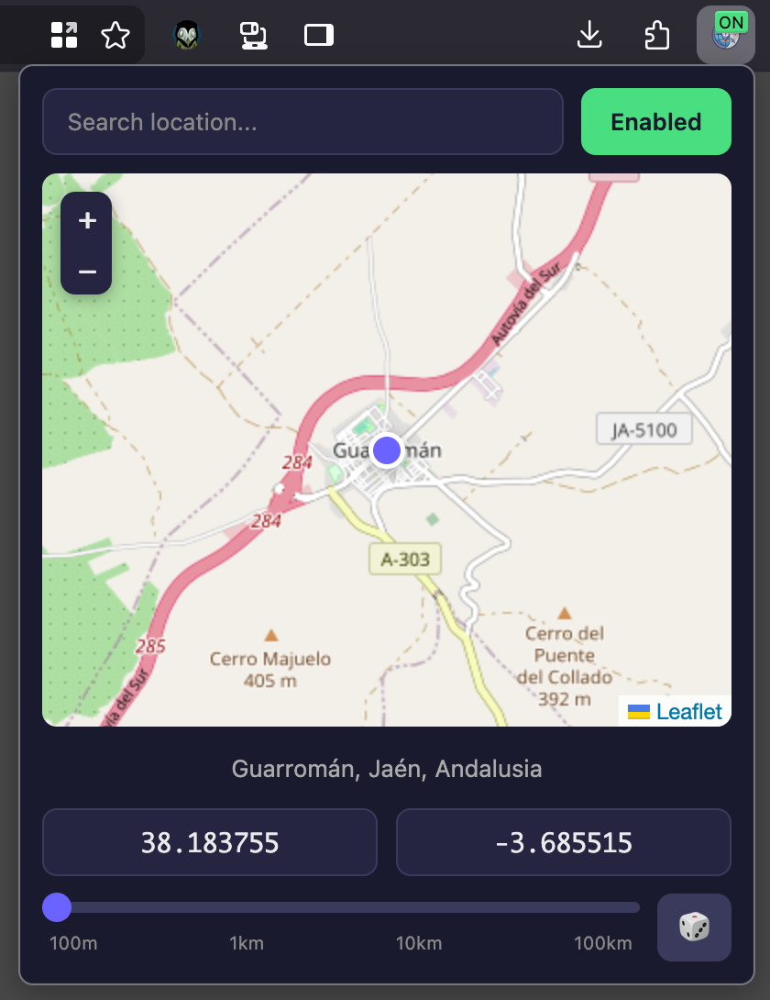

## Introduction

Earlier this year I switched back to Firefox, I want to move away from Google services as much as possible, and one feature that I used sometimes was the ability to spoof my geolocation, not even for nefarious purposes or privacy, mostly for development.

This is something really easy to do on Chrome, without even having to resort to extensions, simply open the developer tools, go to the "Sensors" tab and change your location to whatever place you want, I wish Firefox had something similar built-in, but it doesn't.

My first attempt was to use an existing extension, I couldn't find any that worked well, most of them were either outdated, not working at all, or had the most unintuitive user interface imaginable.

When there are no good options, the best option is to make your own, so I created [GeoMask](https://github.com/dobladov/geomask) following the development mindset that I'm going to call "Better Execution, Same Task" (BEST), the idea is to look at existing solutions, see what they do well and what they don't, and then make something that does it slightly better in each aspect, nothing groundbreaking.

## Goals

Let's start by understanding the main feature, **changing the location directly in the extension popup**, this might sound crazy but most of the extensions I tried, required an options page buried in settings or navigating to a hosted webpage where JS is injected to add UI where the location can be set, and most of those sites are offline and not maintained anymore.

I believe these extensions have weird designs because of how limited and hard to work with the WebExtension APIs are, even more after manifest v3 changes, most of the code has to run isolated from the extension UI, requiring to add weird communication between layers, inject scripts which are very limited, etc, I don't want to rant much about it, but clearly Google does not like extensions and it's forcing Mozilla to follow their enshittification practices.

My extension needs to do the minimum as Google's devtool, a popup with two text fields for latitude and longitude, and a button to apply the changes, and what can be better than that?, if the popup also shows a map with a pin that can be dragged to change the location visually, and search box to find places quickly.

## Development

With that in mind, I created a simple map with [Leaflet](https://leafletjs.com/), my initial thought was to use [d3-geo](https://d3js.org/d3-geo) with a self contained geojson map of the world, but leaflet gives a lot of features out of the box, zoom, panning, and more rich map information, in my opinion is a worthy dependency.

Now that I have a map, I can set coordinates, change the position easily, I need to do the most annoying part of this project, overriding the browsers's [geolocation API](https://developer.mozilla.org/en-US/docs/Web/API/Navigator/geolocation), with the selected coordinates.

For that the [popup](https://github.com/dobladov/geomask/blob/main/extension/popup/popup.mjs) needs to be able to store the coordinates using [browserAPI.storage.local.set](https://developer.mozilla.org/en-US/docs/Web/API/Storage), then a [content](https://github.com/dobladov/geomask/blob/main/extension/content.js) script listens to storage changes with `browserAPI.storage.onChanged.addListener` in order store the coordinates on the page context, but unfortunately a content script cannot override the geolocation API directly, so it needs to [inject](https://github.com/dobladov/geomask/blob/main/extension/inject.js) a `web_accessible_resources` that overrides the `navigator.geolocation.getCurrentPosition` and `navigator.geolocation.watchPosition` methods to return the spoofed coordinates, where this data can be read from the `root.dataset`.

At this point I had a functional extension that could change the location, to polish it a bit more, I added a search box using [Nominatim](https://nominatim.org/release-docs/develop/api/Search/) to find places quickly, a way to reset the location to the real one, dark and light mode, some error handling for invalid coordinates, and a randomize button with distance options.

For the extension itself I decided to use vanilla JS with [JSDOC](https://jsdoc.app/) types validated by typescript to avoid any build step and no UI frameworks, given that there's not much UI, keeping the extension lightweight and simple, *92.1 KB* for [1.0.0](https://github.com/dobladov/geomask/releases/tag/1.0.0)

The extensions should be available soon once approved.
