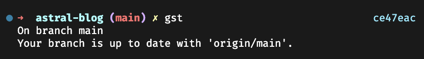

## Introduction

[Git](https://git-scm.com/) is one of my most used work tools, sharpening our tools helps us be more productive and save a lot of time. These are some of my tweaks to speed up my workflow when interacting with git.

## ZSH git aliases

One of the first things I do after setting up my laptop is to install [ZSH](https://www.zsh.org/) and [Oh My ZSH](https://ohmyz.sh/).

Their [aliases](https://kapeli.com/cheat_sheets/Oh-My-Zsh_Git.docset/Contents/Resources/Documents/index) have become completely natural to me, and I can't work without them.

While the list looks a bit overwhelming, it's actually very easy to remember them; most of the time it's the initial letter or how you would pronounce them, for example `git checkout` becomes `gco`.

After a few uses, they become natural, and you will find yourself using them without thinking about it.

These are my most used shortcuts:

- `git fetch` -> `gf`
- `git add` -> `ga`
- `git commit -m` -> `gcmsg`
- `git checkout` -> `gco`
- `git checkout -b` -> `gcb`
- `git merge` -> `gm`
- `git pull origin "$(git_current_branch)` -> `ggpull`
- `git push origin "$(git_current_branch)"` -> `ggpush`

Commands that include variables like `git_current_branch` save a huge amount of time and mental attention.

## Custom aliases

Switching between my latest edited branches is common, and this command helps me quickly visualize my modified branches in order.

```bash
alias branchOrder='git branch --sort=-committerdate'
```

Similar to the last command, it helps to switch branches in a quick way using [fuzzy finder](https://github.com/junegunn/fzf).

```bash
alias gcoi='git checkout $(git branch -a | fzf | xargs)'
```

For one of my projects, we include the PR number on the [Changelog](https://keepachangelog.com/), this command gives me the value without having to open the browser.

```bash
alias lastPR='gh pr list -s all --json number --jq ".|=sort_by(.number)|last|.n>
```

## Global git ignore

I like to keep a global gitignore file, this is useful for ignoring files that are not specific to a project, for example, IDE configuration files.

Adding `devNotes*` is especially useful as it helps me to write notes about a project while being sure they won't be pushed by accident to the repository.

```bash
nano .gitignore_global
git config --global core.excludesfile ~/.gitignore_globa
```

```ts
.DS_Store
.vscode
devNotes*
dev-notes*
```

## ZSH theme

ZSH themes are very customizable, I like to keep it simple, my current one is basically the default one with a few tweaks, a simpler way to display the **branch name** on the left side and the **SHA commit** on the right, content on the `RPROMPT` will be automatically hidden if the content goes over it.

That information helps me understand what I'm working at a glance, avoiding the need to run `git status` or `git branch` to get that information.



```bash
PROMPT="%(?:%{$fg_bold[green]%}➜ :%{$fg_bold[red]%}➜ )"
PROMPT+=' %{$fg[cyan]%}%c%{$reset_color%} $(git_prompt_info)'
RPROMPT='%F{cyan}$(git_prompt_short_sha)%F{reset}'
ZSH_THEME_GIT_PROMPT_PREFIX="%{$fg_bold[blue]%}(%{$fg[red]%}"
ZSH_THEME_GIT_PROMPT_SUFFIX="%{$reset_color%} "
ZSH_THEME_GIT_PROMPT_DIRTY="%{$fg[blue]%}) %{$fg[yellow]%}✗"
ZSH_THEME_GIT_PROMPT_CLEAN="%{$fg[blue]%})"
```

## Gh command

This section is more suited to GitHub than git but since my workflow combines both, I think it's worth mentioning.

I use [GitHub CLI](https://cli.github.com/) mostly for scripting, there are two very simple commands that save me a lot of time, `gh repo view -w` and `gh pr view -w`, they open the current repository or pull request in the browser.

Another command that I like to execute is `gh run watch` to know when a workflow is finished, for example, when I'm running tests on a PR, it can be pipped to the command `say [message]` to get a notification when the workflow is finished.

There's more to this command, but these three options are really useful.


