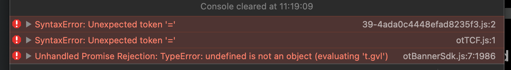
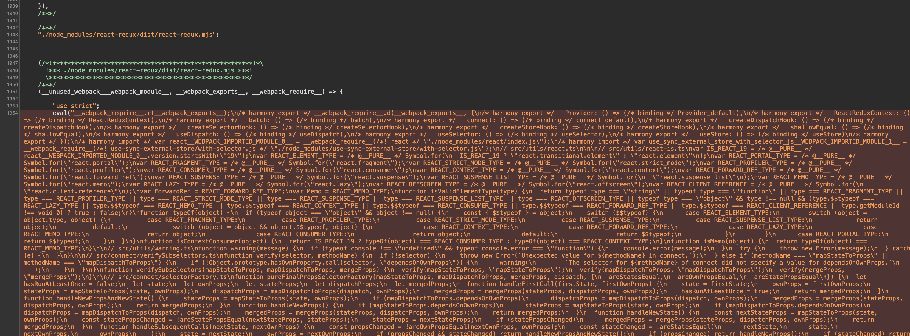

## The problem

I reached a point at work where I have to support old iOS versions, and by old I mean iOS 13, which at the moment of writing this post is 5 years old. If you have to ask me, this is a waste of resources for a very small amount of users and while I made this point clear, this is my job, and it has to be done.

So now on, each release and each upgrade of packages will require testing on devices that even the manufacturers themselves don’t care about anymore. Even worse, we have to keep devices that could be upgraded to another major version locked in old versions.

The device I’m using right now is an *iPhone 8* running `iOS 13.5.1` which is upgradable at least to version `16`, a device released in 2017 and not supported anymore by Apple.

## Identifying the parse error

After upgrading to `react-redux@9.2.0` this old phone is incapable of parsing the bundle, with a very unhelpful message, even with source maps.



We know that some token can’t be read causing the whole app to crash, meaning that one character in the bundle is code that was not supported in this version of iOS. How do we find the precise code?

In this case, I was able to narrow it to the packages updated. If this was not possible, let’s say an existing codebase would need to be adapted to work on old devices, some other debug can be added like including comments with the name of the modules imported to see where it breaks.



Getting closer but how do we know the precise line of code? Bundling in this case removed all the information. Once I knew that `./node_modules/react-redux/dist/react-redux.mjs` was the real issue, the next step was to recreate it on a smaller setup.

```html
<!DOCTYPE html>
<html lang="en">
<head>
    <meta charset="UTF-8">
    <meta name="viewport" content="width=device-width, initial-scale=1.0">
    <title>Document</title>
</head>

<body>
    Debugging react-redux on iOS 13
    <script type="module">
        import './react-redux.mjs'
    </script>
</body>
</html>
```

Once serving this file and accessing it from the device, the error was much more clear, I could see the line causing the issue.

```jsx
  const contextMap = gT[ContextKey] ??= /* @__PURE__ */ new Map();
```

In this case, the operator `??=` [Nullish coalescing assignment](https://developer.mozilla.org/en-US/docs/Web/JavaScript/Reference/Operators/Nullish_coalescing_assignment) was not supported at this version of iOS: [Can I use Search
Nullish coalescing assignment ?](https://caniuse.com/?search=Nullish%20coalescing%20assignment)

## Fixing the code

### Manual Patching

There are various routes to get the problem solved, a simple one would be to patch the library in `node_modules`. Initially, I did it manually to make sure that was the solution for running `react-redux` on the device simply changing the line of code for:

```jsx
//const contextMap = gT[ContextKey] ??= /* @__PURE__ */ new Map();
const contextMap = gT[ContextKey] = gT[ContextKey] === undefined || gT[ContextKey] === null 
  ? /* @__PURE__ */ new Map() 
  : gT[ContextKey];
```

The patch can be more *permanent* using `npx patch-package`: [Stack overflow - Patch a "node_modules" (Node.js) module](https://stackoverflow.com/questions/72820625/what-is-the-proper-way-to-patch-a-node-modules-module/77385111#77385111)

This could be a good hotfix, but we want it fixed for future cases.

### Creating a pull request

Second solution, to create a PR in the `react-redux` project and use less modern JavaScript, this solution is far from ideal. I don’t like to write older code, we should look at the future and while it does make the library more compatible I would have to justify and convince them to merge it, so I decided not to do it.

[Line of code to change](https://github.com/reduxjs/react-redux/blob/7e2fdd4ee2021e4282e12ba9fc722f09124e30cd/src/components/Context.ts#L31)

### Babel plugins

Third solution, transpile the library using [Babel](https://babeljs.io/) to more widely supported JavaScript automatically using plugins, and here is where the issue got more confusing. The project already used Babel to do exactly this, in fact `@babel/preset-env` includes the two plugins that are required to make the failing file work [@babel/plugin-transform-nullish-coalescing-operator](https://babeljs.io/docs/babel-plugin-transform-nullish-coalescing-operator) and [@babel/plugin-transform-logical-assignment-operators](https://babeljs.io/docs/babel-plugin-transform-logical-assignment-operators), but somehow after a build the file ended intact and still containing `??=`.

So what was happening? We had to transpile `react-redux` in the past to support other issues, as I could see in the webpack file `resolve(__dirname, 'node_modules/react-redux')` was in the `include` for `babel-loader`.

Well, the newer version of the package uses JS modules, and now the extension of the file was `.mjs` instead of `.js` meaning that the regex to match the files was completely ignoring the file `/\.(js|jsx)$/`. After simply adding `/\.(js|jsx|mjs)$/` the file was correctly parsed and worked on iOS 13.

## Conclusion

It’s important to understand how other people’s code end up in your build. In this case, I learned how to better debug third-party code with Safari which is not fun, how to adapt code to work in devices that were not supposed to work with it, and how to make sure that the code is transpiled correctly.

I hope this post helps someone in the future, at the very least was useful for a small subset of users that still use old devices.
