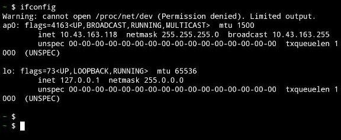
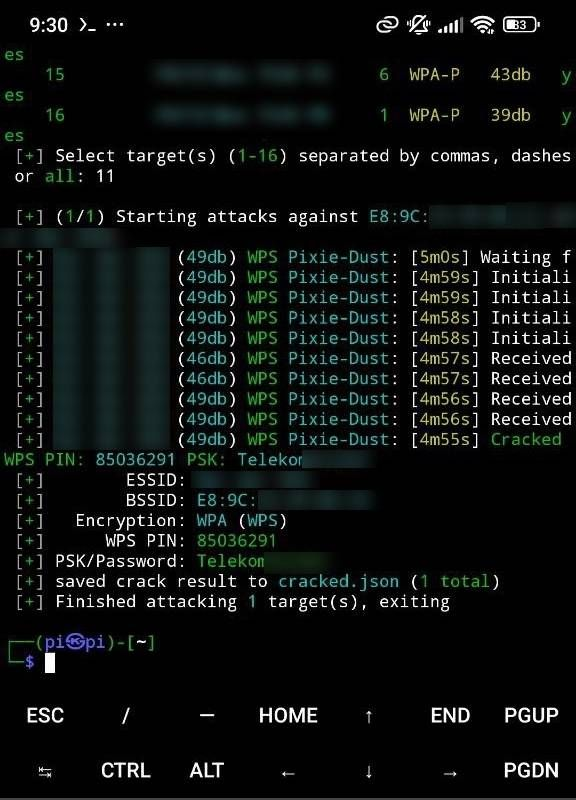

It’s 2025 and routers are somehow secure now, are they really? Well if you have a half decent router it’s most likely safe enough, still there are some settings that can give you some peace of mind.

I wanted to revise my own security and see if most of the old password cracking methods still work or new ones were found. I learned how to crack [WEP](https://en.wikipedia.org/wiki/Wired_Equivalent_Privacy) passwords back when I didn’t have internet, how did I learn it without having internet? I was lucky enough that a guy gave me a ton of PDFs about Linux, programming, and hacking zines, which believe it or not I used to read on my [PSP](https://en.wikipedia.org/wiki/PlayStation_Portable), this probably shaped a lot of my life and career decisions.

## Wired Equivalent Privacy (WEP)

Back then [WEP](https://es.wikipedia.org/wiki/Wired_Equivalent_Privacy) was quite easy to crack, it only requires you to listen to the AP when clients are connected, and capture enough traffic to infer the password, this was a long time ago, and **you’ll basically don’t see any routers now with a WEP password anymore**.

## Wi-Fi Protected Access (WPA)

Then we moved to [WPA](https://en.wikipedia.org/wiki/Wi-Fi_Protected_Access) and here is where we are now, you might ask yourself, can you crack a WPA password like WEP? The short answer is no, but there are other methods that might work, because here is the important thing, router manufacturers are lazy, and will do the bare minimum until the problems hits them.

The first problem with WPA is that an attacker can capture the handshake, this can be easily done with [airodump-ng](https://www.aircrack-ng.org/doku.php?id=airodump-ng), a [dictionary attack](https://en.wikipedia.org/wiki/Dictionary_attack) can be used against the handshake to guess the correct password, there are many tools to speed this process like [hashcat](https://hashcat.net/hashcat/) which uses the GPU, being realistic if the password is secure enough, you won’t ever get it this way, but as I mentioned manufacturers are lazy and sometimes they generate these passwords in a deterministic way.

For example the AP mac address might indicate the manufacturer and version of the router, and if you are lucky someone else might have generated a dictionary with all the default values, or it can be even simpler, I remember finding the mac of my router was similar to another I wanted to check, and I knew my default password was 8 numbers, which made it trivial to generate a dictionary.

**As a general rule handshake cracking is not a viable path anymore**, you need to be lucky with a simple password, and manufacturers, at least the half decent ones got notice and started to create safer default passwords.

If we can only set WEP and WPA passwords, what’s left? [WPS](https://en.wikipedia.org/wiki/Wi-Fi_Protected_Setup), probably one of the dumbest implementations ever made, at least initially.

## Wi‑Fi Protected Setup (WPS)
I believe not used by any normal consumer ever, initially was a way to use an 8 digits PIN instead of the password, there are many issues with it mostly that routers enable it by default, some won’t allow you to change the PIN meaning that if it’s compromised an attacker will always be able to get your password no matter if you change them, but there are even more problems.

8 digits is not such a huge number of options to try, but due to a bad implementation decision, it’s possible to guess and validate the first 4 digits independently of the other last 4 digits, meaning that an attacker can check all possible options really quickly, although manufacturers finally realized this and added rate limits eventually.

Not only the guessing was easy at that point, but with the [Pixie Dust attack](https://en.wikipedia.org/wiki/Wi-Fi_Protected_Setup#Offline_brute-force_attack) it’s even easier and faster, again because manufacturers are lazy, and they lack randomization.

Some manufacturers implemented WPS so bad, that sending a null pin returned the real pin.

And this is the attack that even today I can find some exploitable routers, to give some real perspective, at my current location, within my WIFI reach I can see that only me and another neighbor use WPA 3, the rest have mostly the default security of their router and there are 2 routers vulnerable to WPS attacks so obsolete that they use WPS 1.0.

## Wardriving with a phone*

From here I got curious, and I asked myself if it was possible to do this WPS attack directly from my phone, and in theory it is, in practice Android has so many fences that I kinda gave up, the main issue is that for capturing packages your phone needs to be rooted, which is not easy depending on the model, I don’t want to root my current phone and my old phone sadly died while installing [GrapheneOS](https://grapheneos.org/).

The compromise is to use a phone connected thorough SSH to a [Raspberry Pi](https://www.raspberrypi.com/products/raspberry-pi-3-model-b/) powered by a power-bank, with it, I have a mobile setup capable of doing anything I need.

[Add a picture of the monstrosity]

We need 2 Wi-Fi cards on the Raspberry Pi, one to connect to the phone and a second one in [monitor mode](https://en.wikipedia.org/wiki/Promiscuous_mode) to do the actual packet capturing.

At this point I got a bunch of complication because I don’t have a proper setup, my main RPI had the only good micro SD I had left a home, I was planning to simply flash [Kali Linux](https://www.kali.org/) to it which includes all the necessary tools, but it won’t fit on the *2gb* card I had left.

I opted to use [Alpine Linux](https://www.alpinelinux.org/), a much more slim distribution, that fits on the SD card, with the advantage that boots way faster.

I didn’t have any UBS keyboard a simple way to overcome this is to pre-configure the WIFI during flashing, there are different ways, like creating a file, I recommend using [Raspberry Pi Imager](https://www.raspberrypi.com/software/) which has a nice UI to add settings and also has Apline as an option.

One flashed, we can create an access-point on the phone, that the Raspberry Pi will connect after booting.

But how do we connect to the RPI? We don’t know the IP assigned to the device, and Android does not show the IP for the AP or the clients connected, using [Termux](https://f-droid.org/en/packages/com.termux/), we can check the AP address with `ifconfig`.



Now we can install [nmap](https://nmap.org/) to discover all the clients connected.

```bash
pkg install nmap
nmap 10.43.163.0-255
```

With the newly discover device, we can finally connect with SSH

```bash
ssh root@10.43.163.249
```

Alpine can be configured and permanently installed with `setup-alpine`, and some of the necessary tools added with the package manager, [pixiewps](https://pkgs.alpinelinux.org/package/edge/testing/x86/pixiewps) and [aircrack-ng](https://pkgs.alpinelinux.org/package/edge/community/x86_64/aircrack-ng).

[Package installation on Alpine, (pixiwps, airdump)]

To make it easy to list and attack the available [SSID](https://en.wikipedia.org/wiki/Service_set_(802.11_network))s, [wifite](https://github.com/derv82/wifite2) can be downloaded.

```bash
git clone https://github.com/derv82/wifite2.git
cd wifite

sudo airmon-ng start wlan1 # enables monitor mode on the interface 
sudo airodump-ng -wps -i wlan1 # to find wps 1.0 targets
sudo ./wifite --wps --wps-only # to attack those access points
```

And after a very short try we get the password, this was a very old router that I got for free, as it was configured.



I’m quite pleased with this setup, it’s discrete (on a backpack) and portable, full Linux and boots fast.

As a takeaway, change the default password for a secure one, update your router whenever possible and **always disable WPS**.

## More information

- [Wi-Fi Security issues](https://en.wikipedia.org/wiki/Wi-Fi_Protected_Access#Security_issues)
- [Wardriving](https://en.wikipedia.org/wiki/Wardriving)
